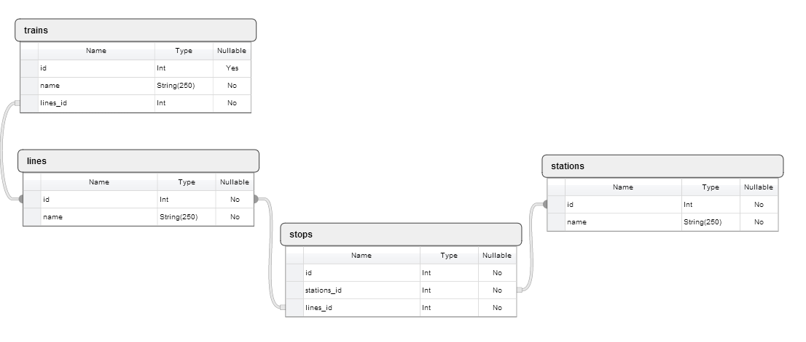

**TRAIN SYSTEM**
----------------
----------------------------------------------------------------
**Train System** is a program that allows a train system operator to create a rail transportation system. The operator can create lines, trains and stations. The operator can also create stops - which link stations and lines - and set trains on specific lines. In addition to this, the operator can also edit and delete any of the lines, trains, stations and/or stops.

For the **Train System** user, the program allows them to check for what trains go to a particular station and what stations a specific line passes through.

**Bugs**
--------
There are no known bugs in the system, should a bug be found, please report it to the author via [email](xmfuko@gmail.com)

**Database Schema**
-------------------

The image below is the representation of the database schema used to build the program.

**Operating Instruction**
-------------------------
1. Clone the program to a working directory from the [repository](https://github.com/EcksZA/train_system_db).
2. In psql, create a database named **_train_system_development_** with tables mimicking the Schema above.*
3. In the working directory, on a ruby-installed command line, type **_ruby train_operator_ui.rb_** to input data in the tables, through the program, as an operator.
4. To use the program as a "user", make sure that the database has initially been populated. Should the database be adequately populate, run **_ruby_train_user_ui.rb_** in a ruby-enabled command line.

**Author**
----------
Xolani Mfuko

**Date**
--------
17 August 2014

**Copying/Licensing**
---------------------
This project is licenced under the **GNU General Public Licence**. For more information on the licence, please visit [gnu](http://www.gnu.org/copyleft/gpl.html).

*Please note:
>  The **id** columns are **serial type**, the **name** columns are **varchar/string** type and the **line_id** and **station_id** are **int** types.